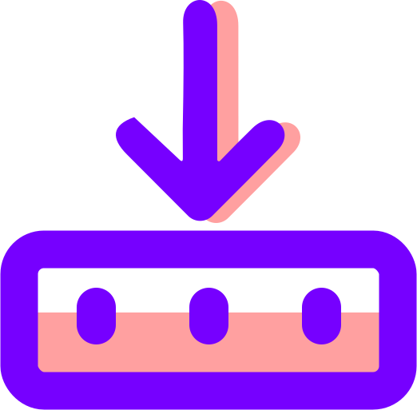
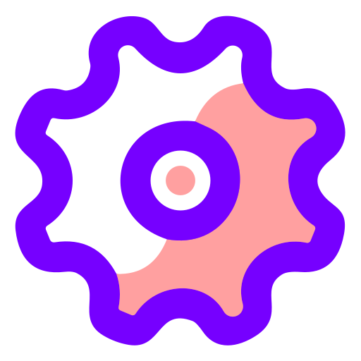

## Esquisse ✍️ 
## Quick AI workflow prototyping.

Esquisse is a light and quick tool for when you need to prototype a generative AI workflow, one level or two above basic prompt engineering.

Draft and test AI ideas, move up from basic prompts to your own mini AI apps.

I (https://github.com/juliendorra) originally built this web-tool so my design students could prototype mini AI-apps in a couple of hours: _a fantasy football club generator, with logo and jersey; a user interview template that auto-update according to answers; an idea helper for products;_ and more!

### Why create this mini AI-app builder?

To give users a malleable and generic way to draft AI usages **one level or two up from just "prompting"**. Without code, my design students managed to build AI pipelines… and also asked for a few updates that I added and tested with them 😅

## Install and use

You can use Esquisse on you own computer by cloning and running the repo: [Local usage](#local-dev)

Or you can easily deploy on Deno Deploy: [Deploy](#deploy-on-deno-deploy)

You will need [OpenAI](https://platform.openai.com/) and [Stability](https://platform.stability.ai) API keys.

## How to create and share mini AI apps?

- Adds text generation and image generation blocks
- You can also add static text blocks and breaks
- Reference and use the result from a text block in another text or image block top 'Data' cell by using either `#name` (no white space, for example a single word block name) or `[name of the block]` (white space allowed in the name of the block)
- You can mix and match several text results using a static text block: `head face [character for head] #style`and then use this text in a text or image generation data field
- ⟳ button refresh a block result by sending a new request
- The _structure_ of your AI cells is **saved in the URL**: names, data text, transform text. Share the URL to share the structure (not the results). You can go back to reload a previous structure.

## Set UI/UX Hints on blocks with  and 

-  button set the block as an _entry_ block, only the data cell is writable.
-  button set the block as an _locked_ block, no cell is writable. 

These are purely UI/UX hints to help you organize your mini-app, and can be reversed any time.
These cells keeps updating normally when the results they reference update.

##  Settings

You can access additonal settings by clicking on the rightmost button in the footer toolbar, the  button.

### Fast & Cheap / Quality

Enabling Quality switch from GPT3.5-turbo and SD2.1 to GPT4 and SDXL in the backend.

The setting is purely temporary in memory and not persisted across different pages or page reloads. Esquisse will for now always load in Fast & Cheap mode, which is a sane default for prototyping.

Initially, Esquisse was using only GPT3.5-turbo and SD2.1. These are fast models, that don't hinder iterations when prototyoping. And so a significant obstacle for replacing all the repetitive promptings with Esquisse apps was the quality of texts and images. But at the same time, switching everything to GPT4 and SDXL is much slower and 6x, 20, 30x more expensive! (image, text input, text output). With the Fast & Cheap / Quality switch, users can prototype quickly and cheaply, and switch to quality mode when it's useful 😃

### Flow view

Enabling the flow view highlight how results from one block flows to another. You can mix and match AI results, the flow view help users check at a glance that they built their AI workflow the way they wanted to.

https://github.com/juliendorra/esquisse/assets/109677/4180b482-dc7d-4fe2-92fc-cdb4e36ef7ab

## Auto naming

Your Esquisse page will automatically be titled using the name of the first group. This make it much easier to find an opened Esquisse page to use again, via tabs, menus or exposé on Mac. It works well when using a Break block at the top of the page as an intro title to the Esquisse page.

## Demo examples

### Building an AI Cadavre Exquis app in 12 minutes (sped up!)

https://github.com/juliendorra/esquisse/assets/109677/96162abe-a2eb-42b2-91e2-5df241a6722b

### Prompt augmentation with Esquisse ✍️
Prompt augmentation is a known trick to create better images with AI models: use an LLM (ex. ChatGPT) to create a very detailed prompt of visual keywords, helping the image diffusion model to find the right spot in its latent space.

With Esquisse, you can build a prompt augmentation workflow with for example inputs for a character and landscape, and reuse it at will, without needing to copy/paste prompts.

https://github.com/juliendorra/esquisse/assets/109677/2ba3c590-2768-420f-874b-80df75f6bd06

### [early version] Screenshot of a simple app that generates three images combining a character and scene as paintings from the the 16th, 17th and 19th century:_

### Students at Strate in the process of creating apps:_

## Local dev
- install Deno locally https://docs.deno.com/runtime/manual/
- clone the repo locally

- create your local .env file based on .env.SAMPLE
- add your OpenAI and Stability API keys
- add at least one local user
- for quick **local** dev you can copy the users from the .env.SAMPLE 

- `deno cache main.ts`
- `deno task dev`
- visit http://127.0.0.1:8000/ to use

## Deploy on Deno Deploy

The code has been written with deployement on Deno Deploy in mind, in a few easy steps:

### Environnement variables: API Keys and users
- Add your OpenAI and Stability API keys in your Deno Deploy Settings / Environnements Variables
- Add users for your instance. Prefixed user name as key and Bcrypt hashed password as value. 
- Prefix the user name with USER_
- You can use a tool like https://bcrypt.online to generate the password hashes

### Deploy 
- link the repo in Deno Deploy Dashboard in automatic mode
- pick main.ts as the entry point
